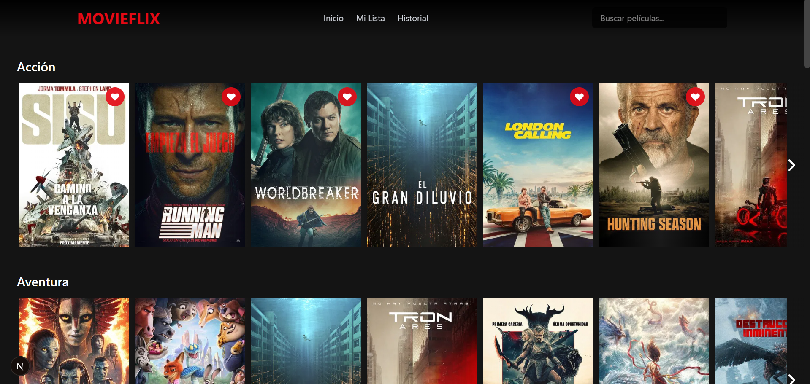
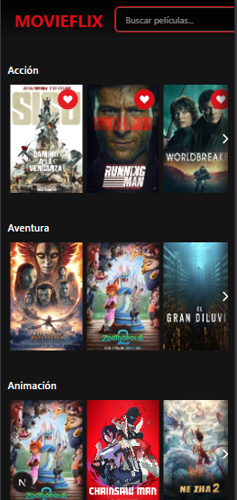

# 📹 MovieFinder – Frontend Portfolio Project

A modern movie discovery application inspired by streaming platforms, built with Next.js, React, and TypeScript, focused on performance, smooth animations, and a polished, production-like user experience.

This project is part of my frontend developer portfolio and showcases advanced component architecture, global state management, API integration, and UI/UX decisions inspired by real-world streaming applications.

---

## 🔗 Live Demo: https://movie-finder-phi-two.vercel.app/

---

### 📸 Preview




---

## 🚀 Features

- Browse movies by popular genres (Netflix-style rows)

- Real-time movie search with debounced input

- Infinite scrolling for search results

- Detailed movie modal with:

- Full movie information

- Trailer playback (YouTube)

- Similar movie recommendations

- Add / remove movies from favorites

- Persistent favorites and viewing history

### Sort favorites by:

- Rating

- Alphabetical order

### Advanced filters:

- Release year

- Minimum rating

- Original language

- Keyboard navigation support (Escape, focus handling)

- Smooth animations and transitions using Framer Motion

- Fully responsive, mobile-first design

- Dark UI inspired by modern streaming platforms

### Note:

The application UI is in Spanish, while the codebase and documentation are written in English.

---

## 🧠 Project Structure

```
src/
├── app/
│ ├── globals.css                  # Global styles and Tailwind setup
│ ├── layout.tsx                  # Root layout
│ └── page.tsx                    # Application entry point
│
├── components/
│ ├── MoviesApp.tsx                     # Main application logic and navigation
│ ├── MovieRow.tsx                      # Horizontal movie rows by genre
│ ├── MoviesGrid.tsx                    # Grid layout for search, favorites, history
│ ├── MovieCard.tsx                     # Individual movie card with hover effects
│ ├── MovieModal.tsx                    # Full-screen movie details modal
│ ├── AdvancedFilters.tsx               # Advanced filtering panel
│ ├── SortDropdown.tsx                  # Favorites sorting
│ ├── LazyImage.tsx                     # Custom lazy-loaded image component
│ ├── Footer.tsx                        # Animated footer with links and social icons
│ └── ToastContainer.tsx                # Notifications
│
├── hooks/
│ ├── useInfiniteScroll.ts              # Infinite scroll logic
│ └── UseKeyboardNavigation.ts          # Keyboard accessibility
│
├── lib/
│ ├── tmdb.ts                         # TMDB API requests
│ ├── store.ts                        # Global state (favorites, filters, history)
│ └── favorites.ts                    # Favorites helpers
│
├── types/
│ └── movie.ts                         # Movie and API TypeScript types
│
└── public/
└── icons / favicons
```

---

## ⚙️ Tech Stack

- Frontend

- React

- Next.js (App Router)

- TypeScript

- Tailwind CSS

- State & Logic

- API: The Movie Database (TMDB)

---

## 🧩 Key Implementation Details

Optimized rendering using memo and controlled re-renders

Debounced search input to reduce API calls

Infinite scrolling with pagination handling

Modular, reusable components

Centralized global state for favorites, filters, sorting, and history

Custom LazyImage component to avoid layout shifts and white flashes

Modal system with nested modals for similar movies

Scroll locking and focus management for accessibility

Netflix-style hover scaling and overlays

---

## 🛠 Installation & Usage

```bash
# Install dependencies
npm install

# Run in development mode
npm run dev

# Build for production
npm run build

# Start production server
npm start
```

Create a .env.local file and add your TMDB API key:

NEXT_PUBLIC_TMDB_API_KEY=your_api_key_here

---

## 🎯 Project Purpose

This project was built to:

Demonstrate advanced React + TypeScript skills

Showcase real-world frontend architecture

Build a UI close to production streaming platforms

Highlight animation, performance, and UX attention to detail

Serve as a strong portfolio project for frontend roles

---

## 👤 Author

Andy Sebastian

Frontend Developer

GitHub: https://github.com/andydevsoftware

Portfolio: In progress
